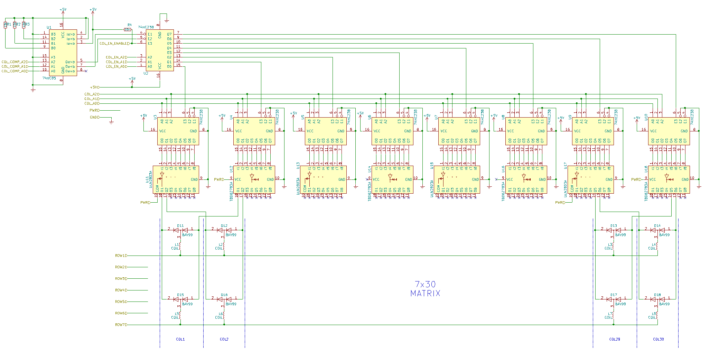

# Playing Tetris on Flip-Dot Display 

The aim of this little project was to reverse engineer a flip-dot display schematic, to design an adapter to interface a display with some off-the-shelf microcontroller and make a simple well-known game like Tetris.

The most expensive part of this project is obviously the display, but in my case I got it at the local Craigslist-like site for only 8 USD. You can search for a similar offer or find a friend at bus or railway depot, maybe they have old (spare) flip-dot screens for sale. 

## Display ##
This is how my display looked like when I got it:

You can read how these displays work in [Wikipedia](https://en.wikipedia.org/wiki/Flip-disc_display) or at related [Hackaday project](https://hackaday.io/project/159415-flip-dot-display-diy-controller). 

## Schematics RevEng ##
I used my multimeter and Kicad to draw a schematic diagram of two parts of the display: LED-part and Flip-Dot-part. 

First, I draw a LED-part, it is pretty simple and self-sufficient. You need only 3 pins to control LEDs in columns via shift registers, and 3 pins to choose a specific row.

Second were flip-dots. As it turned out, my display board only had a column control logic and power circuitry. Row select pins were just fed to IDC-50F connectors.

Both parts have only +5V power and ground rail in common, while all other control and power signals are completely separated and available via two 50-pin IDC connectors on back side of the board.

## Adapter board ##
So, I decided to create an adapter board to control flip-dot rows and provide a convenient interface for [TEENSY 3.5](https://www.pjrc.com/teensy/index.html) Dev board that I had in my table drawer. Actually it could be any arduino-compatible development board with enough GPIO pins.

To make things simple, I chose the same components to select the row as authors of the display used to control the columns. Also I added some glue logic to make sure that current sink and source ICs controlling rows can't be turned on at the same time.
All flip-dot control signals were grouped on one shift register to lessen needed GPIO pins.

In total, only 11 pins are required to control both LED and Flip-Dot parts of the display. Plus 12V power source of course.

## Tetris ##

In the beginning of the project I thought how to use this kind of screen at home. Maybe  to make a clock with large numbers and possibility to display some additional info like weather forecast or data from smart-home sensors. Or to display random motivational messages each morning ;)
Finally I came to the conclusion that nothing could be better than a simple, addictive old-school game like Tetris.

So, we have a screen, an adapter and TEENSY to manipulate pixels on the screen. What is left? That's right - a controller. I ended up with an analog 2-way joystick module with an integrated button. It's almost the same as the Playstation gamepad sticks. I wrote a function to convert joystick position to discrete commands. For Tetris we need: left, right, rotate (up), drop (down). For button press I reserved the "Start New Game" command.

Tetris code is mostly based on great tutorial "[Tetris tutorial in C++ for beginners](http://javilop.com/gamedev/tetris-tutorial-in-c-platform-independent-focused-in-game-logic-for-beginners/)" by Javier López. I rewrote code in plain C and adapted functions responsible for screen refresh as my screen only has 7 rows and 30 columns without any borders. 
It felt awesome to play my own DIY game, but it was not the end.

I decided to use LEDs to show the cleared line count on top of the Tetris well and also to highlight cleared lines by blinking LED.
To make game more compelling, the fall speed was made variable to increase every 10 cleared lines.

## Parts used:
1. Flip-Dot Display by unknown vendor
2. Hand-made cable with IDC-50F connectors at the ends (could be old 50 pin SCSI cable)
3. Proto board
4. [74HC595](datasheet/sn74hc595.pdf) shift register - 1 pcs
5. [74HC238](datasheet/74HC_HCT238.pdf) 3:8 decoder - 2 pcs
6. [ULN2803A](datasheet/uln2803a.pdf) current sink driver - 1 pcs
7. [TBD62783](datasheet/TD62783.pdf) current source driver - pcs
8. 74HC00 4xNAND logic - 1 pcs
9. 7805 voltage regulator - 1 pcs
10. A couple of capacitors and resistors
11. [KY-023](datasheet/KY-023_joystick_module.pdf) joystick module - 1 pcs
12. [TEENSY 3.5](https://www.pjrc.com/teensy/index.html) USB Development Board

## TODO
- create more games: Snake, Motor race, Space Invaders?
- replace analog joystick with a discrete one
- replace TEENSY with ESP32 and add support for the Bluetooth remote controller 